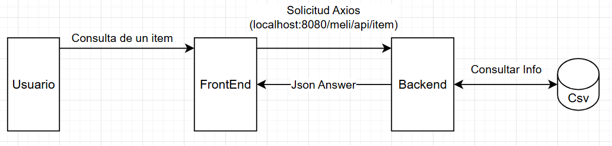
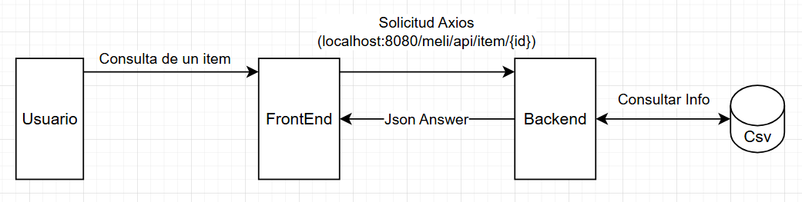
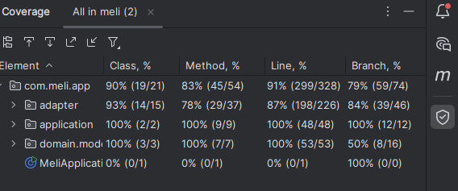
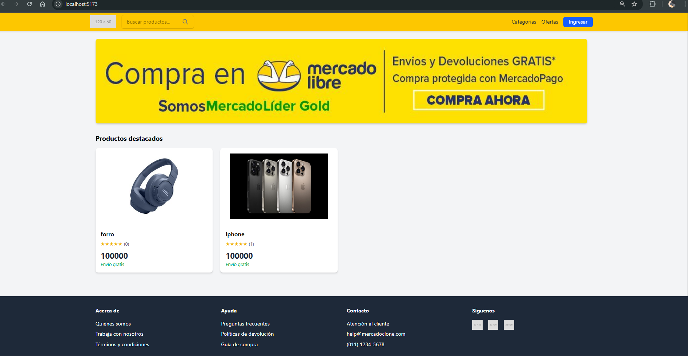
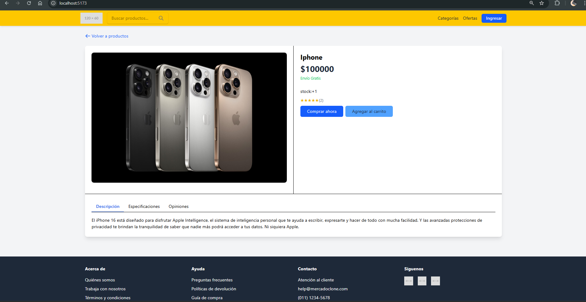

Este proyecto es una aplicación web que emula las funcionalidades básicas de una plataforma de comercio electrónico. El backend está construido con Spring Boot y sigue una arquitectura hexagonal, mientras que el frontend utiliza React y Vite.

---

### 1. Arquitectura del Backend: Hexagonal
**Página de Inicio**

El backend está diseñado con una arquitectura hexagonal, que separa la lógica de negocio central de las dependencias externas como la base de datos y la interfaz de usuario.

* **Dominio (`domain.model`)**: Contiene los modelos de negocio (`Item`, `ItemComplete`, `Seller`).
* **Aplicación (`application`)**: Define las interfaces (puertos) para la comunicación y la lógica de negocio. Incluye puertos de entrada (`port.in`) que son consumidos por los controladores y puertos de salida (`port.out`) que son implementados por la capa de persistencia.
* **Adaptadores (`adapter`)**: Conectan la aplicación con el mundo exterior.
    * `in.controller`: Expone la funcionalidad a través de una API REST.
    * `out.persistence`: Implementa la persistencia de datos. La información se almacena en archivos CSV.

### 2. Capa de Persistencia y Datos

* La persistencia de datos se gestiona a través de un `AbstractCsvRepository`.
* Se utilizan objetos de mapeo (`mapper`) para convertir datos entre entidades de persistencia y modelos de dominio.
* Se usaron `Entities` y `DTOs` sin el sufijo de `Dto`.

### 3. Manejo de Errores

* El proyecto cuenta con un `GlobalExceptionHandler` para centralizar el manejo de excepciones en la API.
* Se utilizan excepciones personalizadas como `ItemNotFoundException`.

---

### 4. Endpoints de la API REST

A continuación se detallan los controladores y sus endpoints, con ejemplos de código:

#### **`ItemController`**

`POST /api/item`

Crea o actualiza un ítem.

* **Content-Type**: `multipart/form-data`
* **Lógica**: Valida el ítem, convierte la imagen a Base64 y delega la creación/actualización al servicio.

`GET /api/item`

Retorna una lista de todos los ítems.

`GET /api/item/{id}`

Busca un ítem por su ID. Incrementa el contador de vistas y, si no lo encuentra, lanza una `ItemNotFoundException`.

#### **`SellerController`**

`POST /api/seller`

Crea o actualiza un vendedor.

* **Validación**: Utiliza `@Valid` para validar el cuerpo de la petición (`@RequestBody`).
* **Respuesta**: Retorna `200 OK` si la operación es exitosa.

---
-----------------------------
#### Covertura total de proyecto


### 5. Frontend

El frontend de la aplicación fue desarrollado con React y Vite. Para la comunicación con el backend, se utiliza la librería Axios.

#### Vistas Principales:

**Página de Inicio**


**Página de Detalle del Producto**



---------------------------------------------------------------------
#### Requisitos previos

Asegúrate de tener instalados los siguientes programas:
* **Java 21 o superior**
* **Maven**
* Un editor de código como IntelliJ IDEA, VS Code o similar.

#### 1. Iniciar el Backend

1.  Abre una terminal en el directorio raíz del proyecto (`/your-project-folder`).
2.  Navega a la carpeta del backend.
3.  Ejecuta el comando de Maven para compilar y ejecutar la aplicación:
    ```bash
    ./mvnw spring-boot:run
    ```
    *Si estás en Windows, es posible que debas usar `mvnw.cmd spring-boot:run`.*

4.  Verifica que el backend se haya iniciado correctamente. Deberías ver un mensaje en la terminal similar a:
    ```
    Started MeliApplication in ...
    ```
    El backend se ejecutará por defecto en el puerto `8080`.

--------------------------
# Link del front
https://github.com/JuanMHerreraMoya/meli-front

